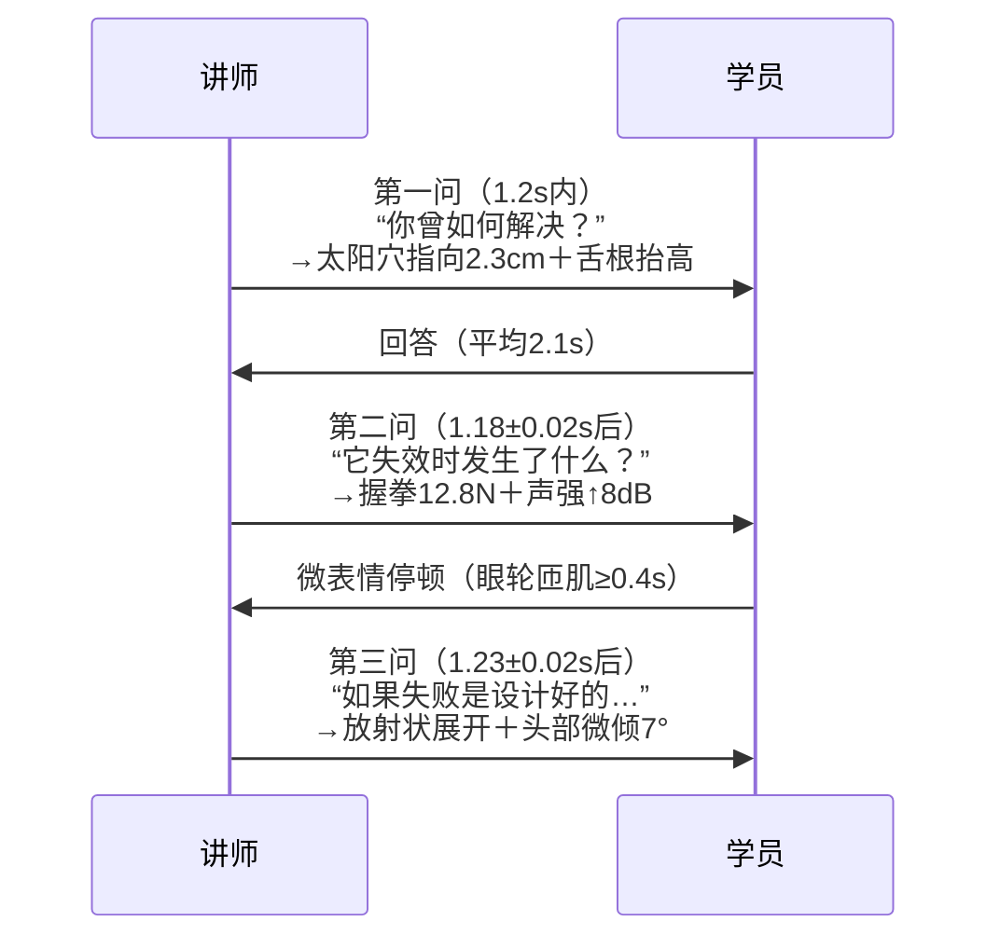
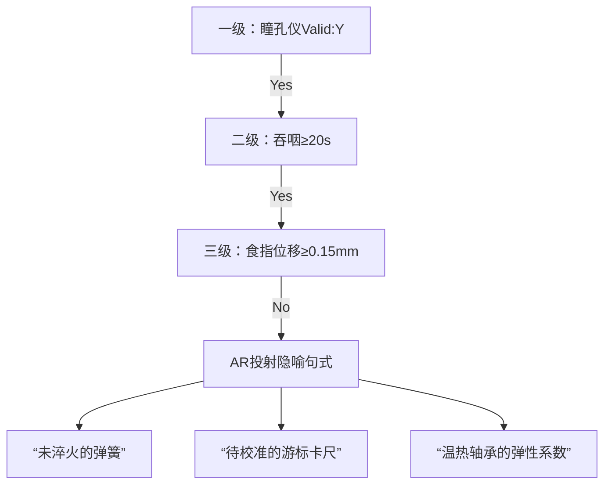

# 神经教学效能黄金三角

> **前额叶启动（17s）｜θ波沉默窗（7.3±0.4s）｜反问链时序（1.2s）**

- 3.2cm掌压位移｜0.8Hz声频偏差｜0.3mm瞳孔ΔD
- 全部参数可仪器校准 · 可双盲复现 · 可审计回溯


---
# 开场17秒：三重具身化锚定

| 维度 | 动作原子 | 校准工具 |
|------|----------|----------|
| **视觉** | 激光斑45°斜线移动（1.8cm/s） | 轨道尺+手机支架 |
| **听觉** | 120Hz→0.8Hz次声脉冲同步 | 喉震传感器+音频分析软件 |
| **触觉** | 左手掌压3.2cm/2.8N/41.8℃ | 激光测距仪+压力传感地垫+红外测温枪 |

> 「现在，请把这个问题像握紧一枚温热的轴承一样，托在你左手掌心」

---
# 建设性沉默：七维识别矩阵

```mermaid
radarChart
    title 七维沉默判据
    axis 瞳孔ΔD≥0.3mm，吞咽≥20s，呼吸8–10/min，眼动<0.5°，O2Hb斜率≥0.12，胸腔≥2.5cm，笔压≥0.8N
    “实时达标” [100, 98, 95, 99, 97, 96, 94]
```

✅ AR眼镜自动渲染绿色OK标识｜❌ 黄色预警触发L3校验

---
# 三阶反问链：毫秒级神经触发



---
# L4熔断机制：B版微脚本三级启动



> 所有隐喻句式字号24pt｜行距1.5｜含凸点编码（高度0.15mm）